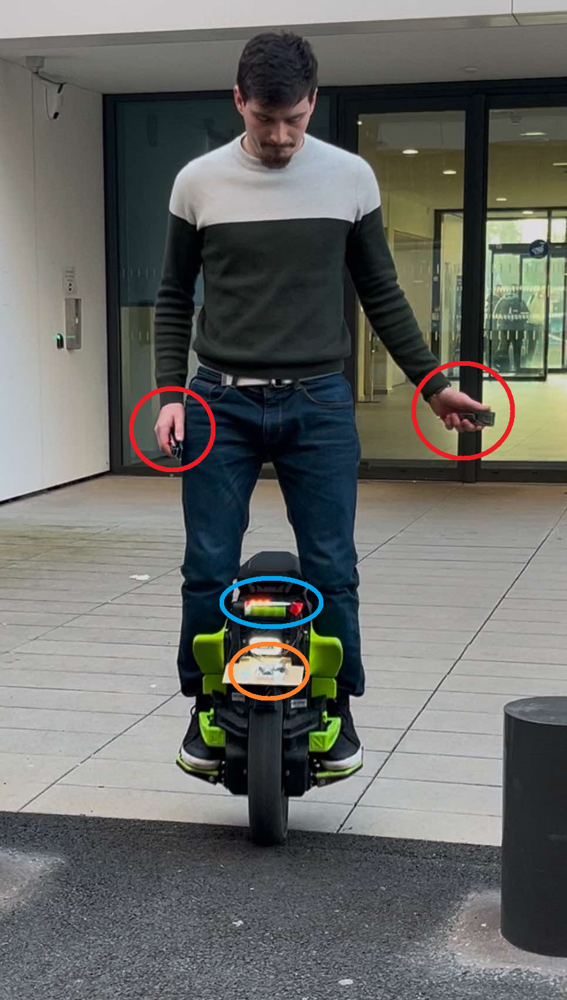
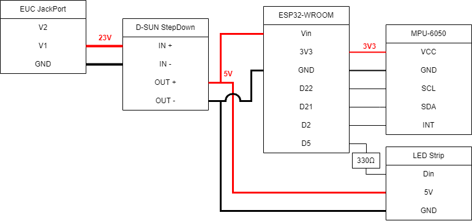

# IMU Solution  
## System Description  
The IMU-based system consists of three main components:  
1. A central module (ESP32-WROOM microcontroller and MPU-6050 IMU).  
2. Two hand modules (each with an ESP32-WROOM microcontroller and an MPU-6050 IMU).  

Each hand module collects accelerometer and gyroscope data and sends it via BLE to the central unit, which processes the data and controls the blinkers.




## Features and Progress  
- **Data Visualization**  
  - Creation of a GUI to visualize real-time motion data.  
- **Data Logging**  
  - Scripts to log BLE-transmitted motion data for further analysis.  
- **Blinker Control**  
  - Prototyping LED blinkers to simulate real-world functionality.  

## Future Work  
- **IMU Solution**  
  - Integrate the second hand module to enable control of both blinkers.  
  - Implement an orientation fusion algorithm (e.g., MotionFX).  
  - Add automatic turn signal deactivation based on yaw velocity.  
  - Miniaturize components and enable induction charging. 

--- 

## Setup

### Environment 

#### Arduino IDE setup

Link to add in File > Preferences > Additional boards manager URLs :

```
https://raw.githubusercontent.com/espressif/arduino-esp32/gh-pages/package_esp32_index.json
```

Link for downloading MPU6050 library:

```
https://minhaskamal.github.io/DownGit/#/home
https://github.com/jrowberg/i2cdevlib/tree/master/Arduino/MPU6050
```

## Usage tutorial


## Notes

Utilisation de MEMS Studio afin de generer un decision tree a partir des donnees IMU, FAILED algo fait main
mems studio features:

        "F1_MEAN_ACC_Z",
        "F2_MINIMUM_ACC_Z",
        "F3_VARIANCE_ACC_Y",
        "F4_MEAN_GYR_V",
        "F5_MAXIMUM_ACC_X",
        "F6_PEAK_TO_PEAK_ACC_Y",
        "F7_ENERGY_GYR_Z",
        "F8_VARIANCE_GYR_Z",
        "F9_MAXIMUM_ACC_V",
        "F10_MINIMUM_GYR_X",
        "F11_MEAN_ACC_X",
        "F12_VARIANCE_GYR_X",
        "F13_MINIMUM_ACC_V",
        "F14_MEAN_ACC_V",
        "F15_ENERGY_GYR_Y"


author : Alix Deleule

### List of Features:

1. [ ] TODO
    1. [ ] GLOBAL - Boîtier / miniaturisation module central
    2. [ ] GLOBAL - Miniaturisation
    3. [ ] POWER - Wireless charging
    4. [ ] BLE - Connection using device name instead of MAC-address
2. [x] IN PROGRESS
    - No tasks currently in progress
3. [x] DONE
    1. [x] MEMS - Implementation of orientation fusion algorithm
    2. [x] IMU - Stop blinkers at the end of turn
    3. [x] MEMS - Data acquisition
    4. [x] MEMS - Ajout 2e module main et intégration à la solution finale
    5. [x] MEMS - Hand module w/ battery and automatic pairing
    6. [x] MEMS - Logger on laptop
    7. [x] MEMS - GUI Data Visualizer
4. [x] DROPPED
    1. [x] MEMS - Logger w/ multiple sensors sending via BLE
    2. [x] MEMS - Save data as MEMS Studio format
    3. [X] MEMS - Create decision tree and script to run it on ESP32
    4. [ ] IMU - Implementation of MFX


## Hardware Architecture

### Central Module


### Hand Module


# Software Architecture


# Description de l'algo


# Vidéos de présentation

[Lien vers la vidéo pitch youtube](url)

[Lien vers la vidéo tutoriel youtube](url)

# Liste des dépendances et pré-requis

- a
- b

# Procédure de mise en route

- a
- b
- n
