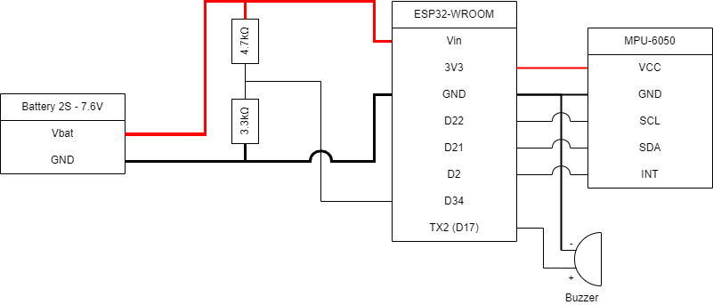

# IMU Solution  
Author : DELEULE Alix

## System Description
The IMU-based system consists of three main components:
1. A central module (ESP32-WROOM microcontroller and MPU-6050 IMU).  
2. Two hand modules (each with an ESP32-WROOM microcontroller and an MPU-6050 IMU).  

Each hand module collects accelerometer and gyroscope data and analyse it for gesture recognition and send the recognized gesture via BLE to the central unit, which then controls the blinkers.

|Hand module|Central Module|Usage illustration|Legend|
|-|-|-|-|
|  |  |  |🔴Hand modules<br>🟠Central module <br>🔵Blinker |

### List of Features:

#### 1. [x] DONE  
**Hand Module**  
1. [x] IMU - Accel/Gyro acquisition  
2. [x] IMU - Calculate IMU features from IMU Data  
3. [x] IMU - Classify gesture from features  
4. [x] BLE - Create server and warn client when a specific gesture is recognized  
5. [x] BLE - Automatic connection  
6. [x] BATTERY - Monitoring  
7. [x] BATTERY - Power supply selection  
8. [x] BUZZER - Low battery warning and BLE connection/disconnection  

**Central Module**  
1.  [x] IMU - Euler angles acquisition  
2. [x] IMU - Start turn detection  
3. [x] IMU - End turn detection  
4. [x] BLE - Create client and connect to hand module servers to receive specific gesture recognition  
5. [x] BLE - Automatic connection  
6. [x] POWER - Power supply decision for rear or headlight via jack port  
7. [x] POWER - Soldering of jack port and usage of a step-down adapter  
8. [x] BLINKERS - Initial implementation with 2 simple LEDs  
9. [x] BLINKERS - Replace simple LEDs with individually addressable RGB LED strip  
10. [x] BLINKERS - LED strip animations and status colors  

**Python Post-Processing**  
1. [x] LOGGER - BLE scanner and connection scripts  
2. [x] LOGGER - Logger script  
3. [x] JUPYTER NOTEBOOK - Use pandas and numpy for algorithm development and offline testing  
4. [x] VISUALIZER - Live data visualizer connecting via BLE to monitor algorithm output  

#### 2. [x] IN PROGRESS  
- No tasks currently in progress  

#### 3. [x] DROPPED
1. [x] MEMS - Logger w/ multiple sensors sending via BLE  
2. [x] MEMS - Save data as MEMS Studio format  
3. [x] MEMS - Create decision tree and script to run it on ESP32  
4. [ ] IMU - Implementation of MFX  

#### 4. [ ] TODO  
1. [ ] GLOBAL - Miniaturize the central module into a case attached to the wheel  
2. [ ] GLOBAL - Miniaturize the hand modules to a watch-like format  
3. [ ] POWER - Wireless charging  
4. [ ] BLE - Connection using device name instead of MAC address  

### Hardware Architecture

#### Central Module


#### Hand Module


### Software Architecture


#### Central module 

```mermaid
sequenceDiagram
    participant User as Utilisateur
    participant ESP32 as ESP32 (Serveur BLE)
    participant IMU as MPU6050
    participant LED as Strip LED
    participant LeftHand as Main Gauche
    participant RightHand as Main Droite

    User ->> ESP32: Démarrage du système
    ESP32 ->> ESP32: Initialisation BLE
    ESP32 ->> IMU: Initialisation MPU6050
    alt MPU connecté
        ESP32 ->> LED: Afficher LED verte
    else MPU non connecté
        ESP32 ->> LED: Afficher LED rouge
    end
    ESP32 ->> BLE: Activer publicité BLE
    BLE -->> ESP32: Client connecté

    par Client Main Gauche
        ESP32 ->> LeftHand: Connexion BLE
        LeftHand -->> ESP32: Notifications activées
        ESP32 ->> LED: Indiquer état BLE avec LED
    and Client Main Droite
        ESP32 ->> RightHand: Connexion BLE
        RightHand -->> ESP32: Notifications activées
        ESP32 ->> LED: Indiquer état BLE avec LED
    end

    loop Lecture IMU
        ESP32 ->> IMU: Lire données capteur
        IMU -->> ESP32: Données brut (accéléro, gyro)
        ESP32 ->> ESP32: Traitement (fusion capteurs)
        ESP32 ->> ESP32: Détection de virage
        alt Virage détecté
            ESP32 ->> LED: Clignoter LED correspondante
        end
    end
```


## Algorithms descriptions

### Hand gestures recognition - Peak detection
We use a buffer to store raw accelerometer and gyroscope data over a set period, allowing us to process multiple readings together. This helps in detecting patterns and trends necessary for accurate gesture recognition. The buffer ensures temporal consistency and efficient data processing.

The window size of 52 was chosen because the MPU6050 sensor outputs data at 52 Hz, meaning it provides 52 samples per second. A 1-second window (52 samples) captures sufficient data to recognize all gestures, as post-processing analysis showed that gestures can be effectively identified within this timeframe. This setup enables both accurate and efficient gesture recognition.

Using raw accelerometer and gyroscope data logged in CSV files, we conducted post-processing analysis. Below are the results showing that gestures can be recognized by detecting peaks in the filtered accelerometer norm within the 1-second window.


The last gesture demonstrates that peak detection using the accelerometer norm is more accurate than using gyroscope data, as the gyroscope detects unnecessary peaks that do not correspond to actual gestures.

**Algorithm Flow**


<br>

**Gesture decision tree :**


### Turn recognition - Peak detection
The turn detection is based on the yaw angle of the MPU6050 sensor, which measures rotation around the vertical axis. Here's an explanation of how the turn detection works:

1. **Yaw Angle Monitoring**:
   - The yaw angle is continuously tracked using data from the MPU6050, which provides the device’s orientation in 3D space. This angle is key to detecting rotations (turns).
   - The yaw angle is obtained from the Euler angles (`ypr[0]`), which are calculated from quaternion data based on the sensor readings.

2. **Turn Detection Logic**:
   - **Start Detection**:
     - The yaw angle (`yaw`) is monitored in the main loop. If the difference between the current yaw angle and the stored yaw angle when the blinker was activated (`startYaw`) exceeds a preset threshold (`TURN_ANGLE_THRESHOLD`), a turn is considered to have started.
     - The system checks if the yaw change is greater than the threshold (set to 20 degrees in this case), and if so, sets the `isTurning` flag to `true`, indicating a turn is in progress.
   - **End Detection**:
     - A buffer of size 15 (`dy_buffer[BUFFER_SIZE]`) is used to track the yaw changes over time. New yaw readings are added to the buffer, and older values are overwritten.
     - The difference in yaw (between current and previous yaw values) is analyzed to determine if the vehicle has stopped turning. If all values in the buffer fall below 0.05, it’s considered that the vehicle is no longer turning and is moving straight. At this point, the blinker can be canceled.


In summary, the system detects turns by monitoring significant changes in the yaw angle. If the yaw change exceeds a set threshold, the vehicle is flagged as turning. This method ensures reliable turn detection, which is crucial for applications like the turn signal controller for EUC vehicles you're developing.

**Algorithm Flow**


**Turn detection :**


### Battery monitoring

1. **Setup**:
   - The `batteryPin` (connected to ESP32 pin `D34`) reads the battery voltage.
   - A voltage divider circuit (4.7 kΩ and 3.3 kΩ resistors) scales down the battery's voltage so it can be safely measured by the ESP32's ADC, which has a maximum input voltage of 3.3V.

2. **Voltage Reading**:
   - The ESP32's ADC reads a value between 0 and 4095, representing 0V to 3.3V.
   - The algorithm calculates the actual battery voltage by scaling the ADC value to the 3.3V range and compensating for the voltage divider (hence the multiplication by 2).

3. **Threshold Check**:
   - The voltage is checked every 3 seconds (`batteryReadInterval = 3000` milliseconds).
   - If the calculated battery voltage drops below 3.5V, the buzzer pin is activated to alert the user of low battery.

4. **Power Efficiency**:
   - By sampling the battery voltage every 3 seconds instead of continuously, the algorithm minimizes unnecessary power usage.

---

#### Key Calculation:
- **Voltage Divider Scaling**:
  - Actual battery voltage = Measured voltage × (4.7 + 3.3) / 3.3 = Measured voltage × 2.
  - This factor is integrated into the code:  
    `batteryVoltage = (analogRead(batteryPin) * 3.3) / 4095.0 * 2`.

#### Flowchart of the Battery Monitoring Logic:


### LED strip

1. **330Ω Resistor on D2 to Din**  
   The 330Ω resistor is used between the D2 pin of the microcontroller and the `Din` of the LED strip to protect the LED strip's data input from potential overcurrent or voltage spikes. This ensures a reliable signal transmission and prevents damage to the LEDs.

2. **LED Colors for Status Indicators**  
   - **Blue**: The LED strip briefly lights up blue to indicate the connection or disconnection of a BLE client (hand module). This visually confirms BLE status.  
   - **Red/Green**:  
     - **Red**: Indicates IMU initialization failure.  
     - **Green**: Indicates successful IMU initialization.

3. **Blinking Behavior**  
   - **Activation**: The hand module sends a BLE command (`"2"`), activating the respective blinker (left or right).  
   - **Deactivation**: The blinker turns off automatically when the end of a turn is detected based on IMU yaw stabilization.

4. **Blinker Animation**  
   The blinker doesn't just toggle the LEDs on and off. Instead, it uses a smooth, flowing animation along the LED strip to create a dynamic and visually appealing effect.


## Explored Alternatives

1. **MEMS Studio Decision Tree Approach**  
   Initially, MEMS Studio was used to generate a decision tree based on IMU data to classify gestures. However, this approach faced several challenges:  
   - The sensor selected for testing wasn't ideal, as it was not an STMicroelectronics sensor. MEMS Studio is intended to be used exclusively with STM products, leading to inaccurate results.  
   - While the decision tree algorithm ultimately failed and had to be replaced with a custom algorithm, it played an important role in inspiring the feature selection for the final peak detection algorithm.  

   Features analyzed by MEMS Studio included various metrics (e.g., mean, minimum, maximum, variance, peak-to-peak, energy, and median) for both accelerometer and gyroscope data across axes (X, Y, Z) and norms.

2. **Streaming Raw IMU Data Over BLE**  
   - IMU data was intended to be streamed from the hand modules and the central module via BLE.  
   - The idea was to subtract the central module's IMU data from the hand module's IMU data to calculate **relative acceleration**, isolating gesture-specific movements.  
   - Although this approach initially seemed to simplify gesture detection, it was later determined to add computational complexity and BLE latency issues, making it impractical.  

3. **LED Implementation for Blinkers**  
   - Early demonstrations used simple LEDs for blinkers.  
   - The final implementation upgraded to LED strips, providing enhanced visual feedback with more sophisticated animations, which greatly improved usability and presentation.  

4. **Additional MEMS Logger and Format Support**  
   - A MEMS logger with multiple sensors was developed to stream data via BLE.  
   - The logger saved data in MEMS Studio's format, enabling compatibility and detailed processing.  
   - A script was created to execute the decision tree on an ESP32 platform, showcasing the flexibility of the setup. However, as mentioned earlier, the MEMS Studio-generated decision tree was eventually replaced with a custom solution.

5. **1S Battery Testing**
   - 1S batteries were tested for their smaller size and lighter weight compared to 2S batteries. However, their voltage was insufficient to power the ESP32 through its Vin pin.


## List of Dependencies and Prerequisites

- Having an Electric Unicycle ;)
- Arduino IDE
  - Board manager
    - Link to add in `File > Preferences > Additional` boards manager URLs :
        ```
        https://raw.githubusercontent.com/espressif/arduino-esp32/gh-pages/package_esp32_index.json
        ``` 
  - Libraries
    - Adafruit NeoPixel
    - MPU-6050
      - Link for downloading MPU6050 library:
      - `Sketch > Include Library > Add .Zip Library`
          ```
          https://minhaskamal.github.io/DownGit/#/home
          https://github.com/jrowberg/i2cdevlib/tree/master/Arduino/MPU6050
          https://github.com/jrowberg/i2cdevlib/tree/master/Arduino/I2Cdev
          ```
- python libs
  - bleak
  - matplotlib
  - pandas
  - numpy
  - PyQt5
  - scipy

## Startup Procedure

- [link to video tutorial]()

## Usage Procedure - Tutorial


