# IMU Solution  

**Author** : *Alix Deleule*

## System Description
The IMU-based system consists of three main components:
1. A central module (ESP32-WROOM microcontroller and MPU-6050 IMU).  
2. Two hand modules (each with an ESP32-WROOM microcontroller and an MPU-6050 IMU).  

Each hand module collects accelerometer and gyroscope data and analyse it for gesture recognition and send the recognized gesture via BLE to the central unit, which then controls the blinkers.

|Hand module|Central Module|Usage illustration|Legend|
|-|-|-|-|
|  |  |  |🔴Hand modules<br>🟠Central module <br>🔵Blinker |

### List of Features:

#### 1. [x] DONE  
**Hand Module**  
1. [x] IMU - Accel/Gyro acquisition  
2. [x] IMU - Calculate IMU features from IMU Data  
3. [x] IMU - Classify gesture from features  
4. [x] BLE - Create server and warn client when a specific gesture is recognized  
5. [x] BLE - Automatic connection  
6. [x] BATTERY - Monitoring  
7. [x] BATTERY - Power supply selection  
8. [x] BUZZER - Low battery warning and BLE connection/disconnection  

**Central Module**  
9. [x] IMU - Euler angles acquisition  
10. [x] IMU - Start turn detection  
11. [x] IMU - End turn detection  
12. [x] BLE - Create client and connect to hand module servers to receive specific gesture recognition  
13. [x] BLE - Automatic connection  
14. [x] POWER - Power supply decision for rear or headlight via jack port  
15. [x] POWER - Soldering of jack port and usage of a step-down adapter  
16. [x] BLINKERS - Initial implementation with 2 simple LEDs  
17. [x] BLINKERS - Replace simple LEDs with individually addressable RGB LED strip  
18. [x] BLINKERS - LED strip animations and status colors  

**Python Post-Processing**  
19. [x] LOGGER - BLE scanner and connection scripts  
20. [x] LOGGER - Logger script  
21. [x] JUPYTER NOTEBOOK - Use pandas and numpy for algorithm development and offline testing  
22. [x] VISUALIZER - Live data visualizer connecting via BLE to monitor algorithm output  

#### 2. [x] IN PROGRESS  
- No tasks currently in progress  

#### 3. [x] DROPPED
1. [x] MEMS - Logger w/ multiple sensors sending via BLE  
2. [x] MEMS - Save data as MEMS Studio format  
3. [x] MEMS - Create decision tree and script to run it on ESP32  
4. [ ] IMU - Implementation of MFX  

#### 4. [ ] TODO  
1. [ ] GLOBAL - Miniaturize the central module into a case attached to the wheel  
2. [ ] GLOBAL - Miniaturize the hand modules to a watch-like format  
3. [ ] POWER - Wireless charging  
4. [ ] BLE - Connection using device name instead of MAC address  

### Hardware Architecture

#### Central Module


#### Hand Module


### Software Architecture


#### Central module 

```mermaid
sequenceDiagram
    participant User as Utilisateur
    participant ESP32 as ESP32 (Serveur BLE)
    participant IMU as MPU6050
    participant LED as Strip LED
    participant LeftHand as Main Gauche
    participant RightHand as Main Droite

    User ->> ESP32: Démarrage du système
    ESP32 ->> ESP32: Initialisation BLE
    ESP32 ->> IMU: Initialisation MPU6050
    alt MPU connecté
        ESP32 ->> LED: Afficher LED verte
    else MPU non connecté
        ESP32 ->> LED: Afficher LED rouge
    end
    ESP32 ->> BLE: Activer publicité BLE
    BLE -->> ESP32: Client connecté

    par Client Main Gauche
        ESP32 ->> LeftHand: Connexion BLE
        LeftHand -->> ESP32: Notifications activées
        ESP32 ->> LED: Indiquer état BLE avec LED
    and Client Main Droite
        ESP32 ->> RightHand: Connexion BLE
        RightHand -->> ESP32: Notifications activées
        ESP32 ->> LED: Indiquer état BLE avec LED
    end

    loop Lecture IMU
        ESP32 ->> IMU: Lire données capteur
        IMU -->> ESP32: Données brut (accéléro, gyro)
        ESP32 ->> ESP32: Traitement (fusion capteurs)
        ESP32 ->> ESP32: Détection de virage
        alt Virage détecté
            ESP32 ->> LED: Clignoter LED correspondante
        end
    end
```



## Setup

### Environment 

#### Arduino IDE setup

Link to add in File > Preferences > Additional boards manager URLs :

```
https://raw.githubusercontent.com/espressif/arduino-esp32/gh-pages/package_esp32_index.json
```

Link for downloading MPU6050 library:

Sketch > Include Library > Add .Zip Library

```
https://minhaskamal.github.io/DownGit/#/home
https://github.com/jrowberg/i2cdevlib/tree/master/Arduino/MPU6050
```

## Algorithms descriptions

### Hand gestures recognition - Peak detection
We use a buffer to store raw sensor data from the accelerometer and gyroscope over a set period. This allows us to process multiple readings together, helping to detect patterns and trends necessary for gesture recognition. The buffer ensures temporal consistency and efficient processing of the data.

We chose a window size of 52 because the MPU6050 sensor outputs data at 52 Hz, meaning it provides 52 samples per second. A 1-second window (52 samples) captures enough data to recognize all gestures, as post-processing analysis showed that gestures can be identified within this timeframe. This setup ensures accurate and efficient gesture recognition.

Below is the preprocessed data showing that the gestures can be recognized by making a peak detection of the filtered accelerometer norm in a 1second window.


This last gesture shows that looking at the peaks of accel instead of gyro is more accurate as gyro detects peaks where there should not be any. 

**Algorithm Flow**


<br><br>

**Gesture decision tree :**


### Turn recognition - Peak detection

### BLE connections

### Battery monitoring

### LED strip


## Explored Alternatives

- MEMS Studio decision tree, not the correct sensor, used anyway but led to innaccurate results, however it was inspiring for the features that were analysed for the peak detection
 - Utilisation de MEMS Studio afin de generer un decision tree a partir des donnees IMU, FAILED algo fait main
mems studio features:
        "F1_MEAN_ACC_Z",
        "F2_MINIMUM_ACC_Z",
        "F3_VARIANCE_ACC_Y",
        "F4_MEAN_GYR_V",
        "F5_MAXIMUM_ACC_X",
        "F6_PEAK_TO_PEAK_ACC_Y",
        "F7_ENERGY_GYR_Z",
        "F8_VARIANCE_GYR_Z",
        "F9_MAXIMUM_ACC_V",
        "F10_MINIMUM_GYR_X",
        "F11_MEAN_ACC_X",
        "F12_VARIANCE_GYR_X",
        "F13_MINIMUM_ACC_V",
        "F14_MEAN_ACC_V",
        "F15_ENERGY_GYR_Y"
- raw IMU data streamed over BLE from both hand module to central module then substract central IMU data to keep only relative accel, then detect gesture from that
- simple led used for blinkers but that was for demo now strip led is better

 MEMS - Logger w/ multiple sensors sending via BLE  
 MEMS - Save data as MEMS Studio format  
 MEMS - Create decision tree and script to run it on ESP32  


## List of Dependencies and Prerequisites

- Having an Electric Unicycle ;)
- Adafruit NeoPixel
- https://github.com/jrowberg/i2cdevlib/tree/master/Arduino/MPU6050
- https://github.com/jrowberg/i2cdevlib/tree/master/Arduino/I2Cdev
- python libs

## Startup Procedure

- [link to video tutorial]()

## Usage Procedure - Tutorial


