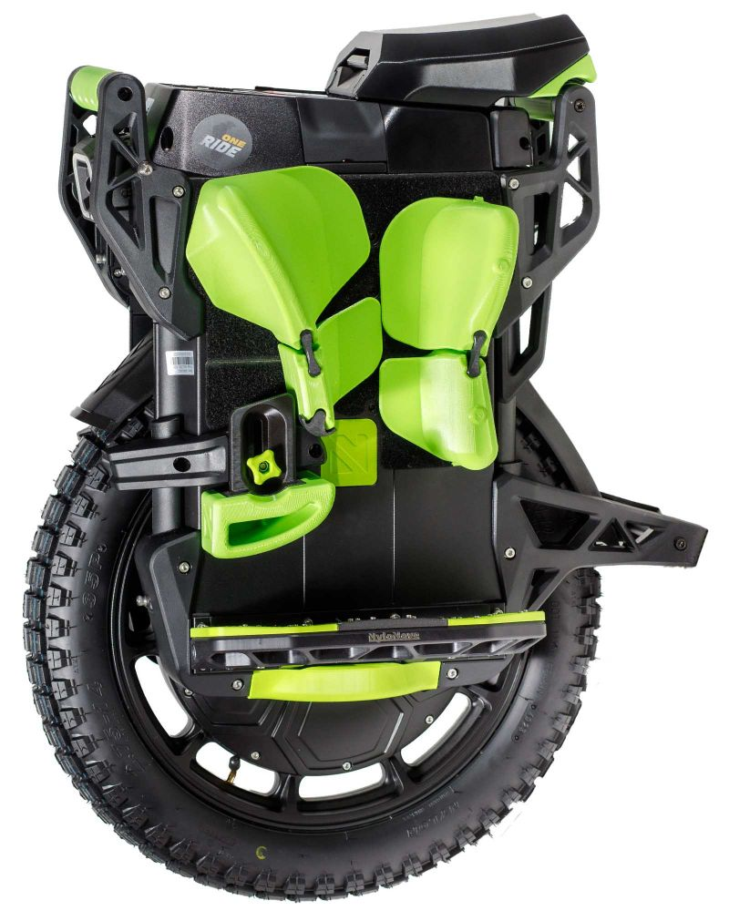

# EUC's Blinkers  
**DELEULE Alix and DELZENNE-ZAMPARUTTI Tinaël**

## Project Overview  
This project aims to activate turn signals (blinkers) for electric unicycles (EUC) using gesture recognition. The goal is to eliminate the need for buttons or phone interactions by leveraging innovative sensor-based solutions.

### Objectives  
- Enable blinkers activation through gestures.  
- Develop and compare two proof-of-concept (POC) solutions using different sensor technologies:  
  - **ToF (Time-of-Flight)**  
    - Utilize the multi-zone `SATEL-VL53L8CX` sensor for gesture detection via distance mapping.  
    - Provide visualizations of gesture data.  
    - [TOF report](TOF/)
  - **IMU (Inertial Measurement Unit)**  
    - Employ `MPU-6050` IMU sensors on each hand to recognize gestures.  
    - Send motion data via BLE to a central unit.
    - [IMU report](IMU/)

