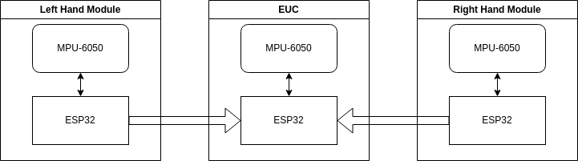

# EUC's Blinkers
*DELEULE Alix and Delzenne-Zamparutti Tinaël*

We will first develop 2 different solutions in parallel to have POC:
- TOF
- MEMS

## TOF 
Use of the multi-zone ToF sensor `SATEL-VL53L8CX` to detect hand and arm gestures.

## MEMS
Use of 2 IMU, 1 on each hand that will recognize gestures and send the information back to the main unit via BLE.

We are using a MPU-6050 as the IMU it is connected to an ESP32 via I2C.
The ESP32 broadcasts the accel and gyro data on BLE to the main EPS32 unit on the wheel.

