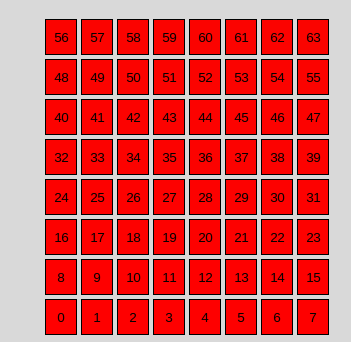

# ToF Solution  

authors : Tinaël Delzenne Zamparutti

## System Description  
The ToF approach uses the `SATEL-VL53L8CX` multi-zone distance sensor to detect hand and arm gestures. This solution provides gesture mapping through an 8x8 zone grid.  

## Features and Progress  
- **Visualization and Data Archiving**  
  - Connects via BLE and serial interfaces to archive gesture data in JSON or CSV formats.  
- **Neural Network Integration**  
  - Train a neural network to classify gestures (e.g., Left, Right, None).

## Feature list

1. [x] VL53L8CX connection
    1. [x] STM32
    2. [x] ESP32
2. [ ] PC connection and GUI
    1. [x] TOF_serial_GUI
    2. [x] BLE_to_CSV
    3. [ ] TOF_BLE_GUI (Unstable)
3. [x] DATA
    1. [x] Labellize
        1. [x] Timestamp
        2. [x] mp4_to_frames
        3. [x] Gui_couple
    2. [x] Training
4. [ ] Final Product
    1. [x] V0
    2. [x] V1
    3. [ ] V2
    4. [ ] Training


# VL53L8CX Connection

## Connection with Nucleo F401RE and Serial PC Communication

This part demonstrates how to interface the VL53L8CX ToF sensor with an Nucleo F401RE microcontroller board and enable serial communication with a PC application for real-time data visualization.

### Overview

The VL53L8CX sensor is connected to the Nucleo F401RE, which runs the `VL53L8CX_SimpleRanging` firmware to gather ranging data. The firmware processes sensor data and sends it to the PC via UART, where [TOF_serial_GUI](Data_processing/TOF_serial_GUI.py) displays the data in real time and logs it for further analysis.


You could find the VL53L8CX_SimpleRanging inside the [X-CUBE-TOF1](https://www.st.com/en/ecosystems/x-cube-tof1.html) packages.

X-CUBE-TOF1/Projects/NUCLEO-F401RE/EXAMPLES/CUSTOM/VL53L8CX_SimpleRanging/

### TOF_serial_GUI

To visualize the data sent by the STM32 we create a GUI based on three functionality :

#### Serial communication
First the serial communication, you can choose the appropriate serial port and Baudrate to receive real-time sensor data. The program also automatically handle connection and disconnection scenarios.

```python
def connect_serial():
    global ser
    try:
        port = port_combobox.get()
        baudrate = int(baudrate_combobox.get())
        ser = serial.Serial(port, baudrate, timeout=1)
        start_reading()
        connect_button.config(state=tk.DISABLED)
        disconnect_button.config(state=tk.NORMAL)
    except serial.SerialException as e:
        text_area.insert(tk.END, f"Error: {e}\n")
        text_area.see(tk.END)
        
def start_reading():
    global read_thread
    read_thread = threading.Thread(target=read_data, daemon=True)
    read_thread.start()
```
#### Archive

We then read the data and archive it in two different formats Json for human analysis and csv for computer analysis we also add timestamps for traceability.

```python
def archive_data(data):
    """
    Archive les données reçues dans un fichier JSON et un fichier CSV avec un horodatage.
    :param data: Les données reçues sous forme de chaîne.
    """
    timestamp = datetime.now().isoformat()  # Format de l'horodatage
    archive_entry = {"timestamp": timestamp, "data": data}  # Structure des données

    # Sauvegarde JSON
    try:
        with open(archive_filename_json, "r") as file:
            archive = json.load(file)  # Charger les données existantes
    except (FileNotFoundError, json.JSONDecodeError):
        archive = []  # Initialiser une nouvelle liste pour cette exécution

    # Ajouter la nouvelle entrée
    archive.append(archive_entry)

    # Écrire les données mises à jour dans le fichier JSON
    with open(archive_filename_json, "w") as file:
        json.dump(archive, file, indent=4)  # Sauvegarde avec indentation pour lisibilité

    # Sauvegarde CSV
    file_exists = os.path.isfile(archive_filename_csv)  # Vérifie si le fichier CSV existe déjà
    with open(archive_filename_csv, "a", newline="") as csvfile:
        csv_writer = csv.writer(csvfile)
        if not file_exists:
            csv_writer.writerow(["Timestamp", "Data"])  # Écrire l'en-tête uniquement si le fichier est nouveau
        csv_writer.writerow([timestamp]+ data.split(','))  # Ajouter une ligne de données
```

#### Visualisation

We created a graphical User Interface in tkinter so we can easily select the serial port and baud rate and display the incoming data string and map values to an 8x8 grid. we also update cell colors dynamically to represent distances using a gradient from red (close) to green (far).

```python
def update_grid(data):
    """
    Met à jour la grille 8x8 avec les valeurs extraites des données, en commençant
    par le coin inférieur gauche, de gauche à droite, puis de bas en haut.
    :param data: Chaîne de caractères sous forme "-2:4,1:4,..."
    """
    try:
        # Transformer les données en une liste d'entiers
        values = [item.split(':')[0] for item in data.split(',') if ':' in item]

        # Parcourir les cases en partant du bas
        index = 0
        for row in range(7, -1, -1):  # Parcourt les lignes de bas en haut
            for col in range(8):  # Parcourt les colonnes de gauche à droite
                if index < len(values):
                    value = values[index]
                    label = grid_labels[row][col]
                    label.config(text=value)  # Mettre à jour le texte
                    # Couleur basée sur la valeur
                    if value == 'X':
                        label.config(bg="grey")
                    else:
                        label.config(bg=get_color(value))
                    index += 1
                else:
                    # Si plus de données, vider la case
                    label = grid_labels[row][col]
                    label.config(text="", bg="white")

def get_color(value):
    """
    Génère une couleur RGB correspondant à un gradient allant de rouge (0) à vert (4000).
    :param value: La valeur entre 0 et 4000.
    :return: Une couleur hexadécimale (#RRGGBB).
    """
    try:
        # Normalisation de la valeur entre 0 et 1
        normalized = max(0, min(int(value) / 4000, 1))
        # Calcul des composantes rouge et verte pour le gradient
        red = int((1 - normalized) * 255)  # Diminue le rouge
        green = int(normalized * 255)  # Augmente le vert
        # Retourne une couleur hexadécimale (#RRGGBB)
        return f"#{red:02x}{green:02x}00"
    except Exception as e:
        print(f"Erreur dans get_color: {e}")
        return "#ffffff"  # Retourne blanc en cas d'erreur

```

For the STM32 Serial connection you want to uses these parameters : 

Port : /dev/ttyACM0

Baudrate : 460800

[Here's the Result](vid/capteur_tof.mp4)

## Connection with ESP32 TTGO-Tdisplay and Serial PC Communication

This part demonstrates how to interface the VL53L8CX ToF sensor with an ESP32 microcontroller board and enable serial communication with a PC application for real-time data visualization.


The Time of Flight sensor is connectef to the ESP32 TTGO T-Display which runs [ESP32_serial](Firmware/ESP32/ESP32_serial.ino), ([Source](https://github.com/stm32duino/VL53L8CX/blob/main/examples/VL53L8CX_HelloWorld_I2C/VL53L8CX_HelloWorld_I2C.ino
)) firmware to gather and send Tof's data. We will then uses [TOF_Serial_Gui](Data_processing/TOF_serial_GUI.py) with these parameters to receive the data : 

Port : /dev/ttyUSB0

Baudrate : 115200


## Connection with ESP32 TTGO-Tdisplay and BLE PC Communication

To connect to the PC via BLE, the sensor is wired in the same way as for the serial connection, but we will modify the ESP32 code ([New version here](Firmware/ESP32/ESP32_serial.ino)).

We add the BLE initialization : 
```cpp
// Initialisation BLE
  BLEDevice::init("ESP32_EUC_VL53L8CX_Sensor");  // Nom de l'appareil BLE
  BLEServer *pServer = BLEDevice::createServer();
  BLEService *pService = pServer->createService(SERVICE_UUID);

  pCharacteristic = pService->createCharacteristic(
    CHARACTERISTIC_UUID,
    BLECharacteristic::PROPERTY_READ |
    BLECharacteristic::PROPERTY_NOTIFY
  );
  pCharacteristic->addDescriptor(new BLE2902());

  pService->start();
  BLEAdvertising *pAdvertising = BLEDevice::getAdvertising();
  pAdvertising->start();
  SerialPort.println("BLE prêt et en mode publicité !");
```

We also modify the print-result function to send data through BLE connection :

```cpp
  pCharacteristic->setValue(data.c_str());  // Met à jour la valeur de la caractéristique
  pCharacteristic->notify();  // Envoie la notification aux clients connectés
```

### TOF_BLE_GUI // BLE_to_CSV

to visualize these data we will use the same base as TO_serial_GUI, we will only modify the connection part so now we are able do scan BLE devices nearby and connect to them thanks to their MAC adress, this program is able to display a grid and archive data just like the first one.

```python
SERVICE_UUID = "4fafc201-1fb5-459e-8fcc-c5c9c331914b"  # Remplacez si nécessaire
CHARACTERISTIC_UUID = "beb5483e-36e1-4688-b7f5-ea07361b26a8"  # Remplacez si nécessaire

async def log_ble_data():
    DEVICE_ADDRESS = device_address_entry.get()  # Récupérer l'adresse du périphérique saisie
    async with BleakClient(DEVICE_ADDRESS) as client:
        print(f"Connexion au périphérique {DEVICE_ADDRESS}")

        # Vérifiez les services et caractéristiques du périphérique
        services = await client.get_services()
        print("Services et caractéristiques :")
        for service in services:
            print(f"Service UUID: {service.uuid}")
            for char in service.characteristics:
                print(f"\tCaractéristique UUID: {char.uuid}")
        
        # Vérifiez si la caractéristique souhaitée existe
        characteristic_found = False
        for service in services:
            for char in service.characteristics:
                if char.uuid == CHARACTERISTIC_UUID:
                    characteristic_found = True
                    break
        
        if not characteristic_found:
            print("Caractéristique non trouvée.")
            return

        # Fonction pour traiter les notifications BLE
        def handle_notification(sender, data):
            line = data.decode("utf-8").strip()
            print(f"Données reçues : {line}")
            text_area.delete(1.0, tk.END)
            text_area.insert(tk.END, f"{line}\n")
            text_area.see(tk.END)  # Auto-scroll to the bottom
            try:
                archive_data(line)
                update_grid(line)
            except (IndexError, ValueError):
                print("Erreur de parsing :", line)

        # Ouvrir les notifications
        await client.start_notify(CHARACTERISTIC_UUID, handle_notification)
        print("Notifications activées. Appuyez sur Ctrl+C pour arrêter.")
        
        # Attente pour recevoir les notifications
        while True:
            await asyncio.sleep(1)

async def scan_ble_devices():
    scan_text_area.delete(1.0, tk.END)  # Effacer le contenu précédent de la text_area du scan
    scan_text_area.insert(tk.END, "Scan des périphériques BLE en cours...\n")  # Ajouter un message initial
    devices = await BleakScanner.discover()
    if not devices:
        scan_text_area.insert(tk.END, "Aucun périphérique détecté.\n")
    else:
        scan_text_area.insert(tk.END, f"{len(devices)} périphérique(s) détecté(s) :\n")
        for device in devices:
            name = device.name
            if "ESP32_EUC" in name:  # Vérifie s'il contient "ESP32_EUC"
                scan_text_area.insert(tk.END, f"Nom : {name}, Adresse MAC : {device.address}\n")
```


Sometimes we got issues with asyncio and tkinter running simultaneously even with the use of threading so in case we create [BLE_to_CSV](Data_processing/BLE_to_CSV.py)
It's a light version of TOF_BLE_GUI without the tkinter interface, so we got a backup plan and get the csv anyways.

## DATA

Now that we got our data we have to create our neural network so it automatically knows thanks to the sensor values when to activate the blinkers. 
We got csv data that display sensor values [values.csv](Data_processing/Archives_csv/fichier_test1.csv) and also video of what the captor is viewing [values.mp4](vid/fichier_test1.mp4).

Now we habe to link these two together so we can add label to our data

### Timestamp

First we need to see if the timestamp of ou video is the same as our data so we create [timestamp.py](Data_processing/timestamp.py), we use hachoir library to get metadata out of the file. 

Example : 

```python
python3 timestamp.py 
```
```python
Entrez le chemin du fichier MP4 : TOF/vid/fichier_test1.mp4
Date de création de la vidéo : 2025-01-13 13:27:35
```

### mp4_to_frames 

This code extracts frames from a video file and calculates the timestamp for each frame. It opens the MP4 file, retrieves the total number of frames and the frames per second (FPS), then iterates through each frame, calculating and printing its timestamp. Finally, the video file is closed. This ones help us when debug.

### Gui couple

Finally we creat another GUI to help us labelize the data, [Gui_couple](Data_processing/GUI_couple.py) links together a csv files and a mp4 files so we get the visualisation grid and the corresponding frames, this code then allow us to labelize our data with differents labels such as righ_arm, left_arm, nothing.

First we load both files, 

```python
def load_csv():
    filepath = filedialog.askopenfilename(
        title="Sélectionner un fichier CSV",
        filetypes=[("CSV files", "*.csv")]
    )
    if not filepath:
        file_label.config(text="Aucun fichier choisi")
        return
    try:
        with open(filepath, "r") as file:
            reader = csv.reader(file)
            global data, new_csv_path, labeled_data
            data = list(reader)
            timestamps = [row[0] for row in data if row]  # Collecte les timestamps
            timestamp_dropdown['values'] = timestamps
            file_label.config(text=f"Fichier choisi : {filepath.split('/')[-1]}")

            # Créer le dossier `data_label` s'il n'existe pas
            os.makedirs("data_label", exist_ok=True)

            # Chemin pour le nouveau fichier CSV
            import datetime
            timestamp = datetime.datetime.now().strftime("%Y%m%d_%H%M%S")
            new_csv_path = os.path.join("data_label", f"labeled_data_{timestamp}.csv")
            
            # Charger les données existantes dans le dictionnaire
            if os.path.exists(new_csv_path):
                with open(new_csv_path, "r") as labeled_file:
                    labeled_reader = csv.reader(labeled_file)
                    next(labeled_reader, None)  # Sauter l'en-tête
                    labeled_data = {row[0]: row[1] for row in labeled_reader}

            # Créer le fichier si ce n'est pas encore fait
            else:
                with open(new_csv_path, "w", newline="") as new_file:
                    writer = csv.writer(new_file)
                    writer.writerow(["Data", "Label"])  # Entêtes

            print("Succès", "Fichier CSV chargé avec succès.")
    except Exception as e:
        messagebox.showerror("Erreur", f"Impossible de charger le fichier : {e}")

def load_mp4():
    filepath = filedialog.askopenfilename(
        title="Sélectionner un fichier MP4",
        filetypes=[("MP4 files", "*.mp4")]
    )
    if not filepath:
        mp4_file_label.config(text="Aucun fichier MP4 choisi")
        return
    mp4_file_label.config(text=f"Fichier MP4 choisi : {filepath.split('/')[-1]}")
    print("Succès", "Fichier MP4 chargé avec succès.")

```

Then we select our timestamp this will update our grid and take the corresponding frame in the mp4 files.

```python
    """
    Extrait une frame d'un fichier MP4 à un timestamp donné en prenant en compte le timestamp
    de création de la vidéo et le timestamp du CSV.
    """
    # Récupérer la date de création du fichier vidéo
    video_creation_time = get_video_timestamp(mp4_filepath)
    print("video_norm")
    print(normalize_timestamp(video_creation_time))
    # Convertir le timestamp du CSV en datetime
    timestamp = datetime.fromisoformat(timestamp_str)
    print("csv_norm")
    print(normalize_timestamp(timestamp))
    # Calculer la différence entre le timestamp du CSV et la date de création de la vidéo
    time_diff = normalize_timestamp(timestamp) - normalize_timestamp(video_creation_time)
    print(time_diff)

    # Convertir cette différence en secondes
    timestamp_seconds = time_diff.total_seconds()

    # Ouvrir le fichier MP4
    cap = cv2.VideoCapture(mp4_filepath)
    if not cap.isOpened():
        print("Erreur d'ouverture du fichier MP4")
        return None

    # Calculer le numéro du frame en fonction du timestamp
    fps = cap.get(cv2.CAP_PROP_FPS)  # Nombre d'images par seconde
    frame_number = int(fps * timestamp_seconds)
    print("test3")
    print(frame_number)

    # Vérifier si le numéro de la frame est dans les limites de la vidéo
    total_frames = int(cap.get(cv2.CAP_PROP_FRAME_COUNT))
    if frame_number < 0:
        frame_number = 0  # Ne pas aller avant le début de la vidéo
    elif frame_number >= total_frames:
        frame_number = total_frames - 1  # Ne pas dépasser la dernière frame

    # Lire la frame à l'index calculé
    cap.set(cv2.CAP_PROP_POS_FRAMES, frame_number)
    ret, frame = cap.read()

    cap.release()
    if ret:
        return frame
    else:
        print(f"Impossible d'extraire la frame à {timestamp_str}")
        return None
```

we got to normalize timestamp so we can get the nearest frames corresponding to our sensor values. Now we can view both the grid our csv data and the corresponding image, we add three button on the gui to help labelize (press a label button got to the next timestamp automatically, also you can label one timestamp multiple times but only the last one will remain).
```python
def save_label(label):
    """
    Sauvegarde ou met à jour les données actuelles de `text_area` avec le label donné dans le fichier CSV.
    """
    global new_csv_path, labeled_data
    try:
        data_to_save = text_area.get("1.0", tk.END).strip()  # Récupère le texte de la zone de texte
        if not data_to_save:
            messagebox.showwarning("Attention", "Aucune donnée à sauvegarder.")
            return
        
        select_next_timestamp()

        # Vérifier si les données existent déjà
        if data_to_save in labeled_data:
            labeled_data[data_to_save] = label  # Mettre à jour le label
            print("Mise à jour", f"Le label a été mis à jour pour '{data_to_save}'.")
        else:
            labeled_data[data_to_save] = label  # Ajouter une nouvelle entrée
            print("Succès", f"Données enregistrées avec le label '{label}'.")

        # Écrire les données dans le fichier CSV
        with open(new_csv_path, "w", newline="") as file:
            writer = csv.writer(file)
            writer.writerow(["Data", "Label"])  # Réécrire l'en-tête
            for data, lbl in labeled_data.items():
                writer.writerow([data, lbl])
```

[Example here](vid/labelling_data.mp4)

This created labelize data in our data_label folder.
For training we will merge all this files into one [data.csv](Data_processing/data.csv)

### Entrainement

We finally get our labelled data we can now train our model for we can now use [Entrainement.py](Data_processing/Entrainement.py) to create a model designed to be implemented on our STM32F4 (originally planned on na STM32N6)

This code performs three main functions:

Data Loading and Preparation: It reads a CSV file, cleans and processes the data (handling non-numeric values and missing data), and encodes the labels into a one-hot format for use in machine learning models.

```python
def load_and_prepare_data(csv_file):
    # Lire le fichier CSV
    data = pd.read_csv(csv_file, header=None)

    # Remplacement des valeurs non numériques (exemple: "X:X")
    data.replace({'X:X': 0, 'X': 0}, inplace=True)  # Ajoutez d'autres motifs si nécessaire

    # Conversion des colonnes d'entrée en type float, en gérant les erreurs
    try:
        features = data.iloc[:, :-1].apply(pd.to_numeric, errors='coerce').fillna(0)
    except Exception as e:
        print("Erreur lors de la conversion des features :", e)
        raise

    # Traitement des étiquettes (dernière colonne)
    labels = data.iloc[:, -1].astype(str)  # Convertir les étiquettes en chaînes si nécessaire
    label_encoder = LabelEncoder()
    encoded_labels = label_encoder.fit_transform(labels)
    categorical_labels = to_categorical(encoded_labels)  # Encodage one-hot

    return features, categorical_labels, label_encoder.classes_
```

Model Training: It builds and trains a neural network using TensorFlow/Keras with a specified architecture to classify the processed data.

```python
def train_model(features, labels):
    input_dim = features.shape[1]
    output_dim = labels.shape[1]
    model = Sequential([
        Dense(128, input_dim=input_dim, activation='relu'),
        Dense(64, activation='relu'),
        Dense(output_dim, activation='softmax')
    ])
    model.compile(optimizer='adam', loss='categorical_crossentropy', metrics=['accuracy'])
    model.fit(features, labels, epochs=10, batch_size=32, validation_split=0.2)
    return model
```

Model Conversion and Export: It converts the trained model to TensorFlow Lite format and generates C code to embed the model for deployment, particularly on STM32 microcontrollers.

```python
def convert_to_tflite_and_export(model, output_dir):
    # Créer le répertoire de sortie s'il n'existe pas
    if not os.path.exists(output_dir):
        os.makedirs(output_dir)
        print(f"Répertoire créé : {output_dir}")

    # Convertir le modèle en TFLite
    converter = tf.lite.TFLiteConverter.from_keras_model(model)
    tflite_model = converter.convert()

    # Sauvegarder le modèle TFLite
    tflite_path = os.path.join(output_dir, "model.tflite")
    with open(tflite_path, "wb") as f:
        f.write(tflite_model)

    print(f"Modèle TFLite exporté vers : {tflite_path}")
    
    # Générer un fichier C
    with open(f"{output_dir}/model.cc", "w") as f:
        tflite_hex = ', '.join(f'0x{b:02x}' for b in tflite_model)
        f.write(f"""
#include <stddef.h>
#include <stdint.h>

const unsigned char model[] = {{ {tflite_hex} }};
const size_t model_len = {len(tflite_model)};
        """)
```

We also included tracking features that helped us review our model performances : 

```python
history = model.fit(features, labels, epochs=10, batch_size=32, validation_split=0.2)

# Visualisation des performances
plt.figure(figsize=(12, 5))

# Courbe de perte
plt.subplot(1, 2, 1)
plt.plot(history.history['loss'], label='Train Loss')
plt.plot(history.history['val_loss'], label='Validation Loss')
plt.title('Loss')
plt.xlabel('Epochs')
plt.ylabel('Loss')
plt.legend()

# Courbe de précision
plt.subplot(1, 2, 2)
plt.plot(history.history['accuracy'], label='Train Accuracy')
plt.plot(history.history['val_accuracy'], label='Validation Accuracy')
plt.title('Accuracy')
plt.xlabel('Epochs')
plt.ylabel('Accuracy')
plt.legend()

plt.tight_layout()
plt.show()
```

## Final Product

Here are the model that currently work first we got a version 0 with the ESP32 TTGO T-Display, this version calculates the means on right sides sensor and left sides sensor to activate the left light or the right light. [Version_0](Firmware/ESP32/ESP32_BLE_V0.ino)
```cpp
// Calcul des moyennes des distances pour gauche et droite
  if ((j + i) % zones_per_line < zones_per_line / 2) { // Zones de gauche
    left_sum += distance;
    left_count++;
  } else { // Zones de droite
    right_sum += distance;
    right_count++;
  }

  ...     

  // Calcul des moyennes
  int left_avg = (left_count > 0) ? (left_sum / left_count) : 0;
  int right_avg = (right_count > 0) ? (right_sum / right_count) : 0;

  // Allumer/éteindre les LEDs en fonction des moyennes
  if (left_avg > 0 && left_avg < 1200) {
    digitalWrite(LED_LEFT_PIN, HIGH);
  } else {
    digitalWrite(LED_LEFT_PIN, LOW);
  }

  if (right_avg > 0 && right_avg < 1200) {
    digitalWrite(LED_RIGHT_PIN, HIGH);
  } else {
    digitalWrite(LED_RIGHT_PIN, LOW);
  }
```

### V1

For the first accurate version we review the data we got from the archive and through the visualisation grid we estimate that certain part of the grid can signify a left arm swing or a right arm so we implement a score system based on the distance values on certain zone of the grid, and throught the test we maximise the efficiency of this method.



```cpp
void print_result(VL53L8CX_ResultsData *Result)
{
  // Répartition des zones et points
  const int left_zones_1pt[] = {7, 15, 23, 31, 39, 47};  // Zones gauche, 1 point
  const int left_zones_2pt[] = {6, 14, 22, 30, 38, 46};  // Zones gauche, 2 points
  const int right_zones_1pt[] = {0, 8, 16, 24, 32, 40};  // Zones droite, 1 point
  const int right_zones_2pt[] = {1, 9, 17, 25, 33, 41};  // Zones droite, 2 points

  const int left_1pt_count = sizeof(left_zones_1pt) / sizeof(left_zones_1pt[0]);
  const int left_2pt_count = sizeof(left_zones_2pt) / sizeof(left_zones_2pt[0]);
  const int right_1pt_count = sizeof(right_zones_1pt) / sizeof(right_zones_1pt[0]);
  const int right_2pt_count = sizeof(right_zones_2pt) / sizeof(right_zones_2pt[0]);

  int left_score = 0, right_score = 0;

  // Fonction pour ajouter des points si conditions respectées
  auto add_points = [&](const int zones[], int count, int points, int &score) {
    for (int i = 0; i < count; i++) {
      int zone = zones[i];
      if (Result->nb_target_detected[zone] > 0) {
        int distance = Result->distance_mm[VL53L8CX_NB_TARGET_PER_ZONE * zone];
        if (distance >= 400 && distance <= 1200) {  // Conditions de distance
          score += points;
        }
      }
    }
  };

  // Calcul des scores gauche et droite
  add_points(left_zones_1pt, left_1pt_count, 10, left_score);
  add_points(left_zones_2pt, left_2pt_count, 20, left_score);
  add_points(right_zones_1pt, right_1pt_count, 10, right_score);
  add_points(right_zones_2pt, right_2pt_count, 20, right_score);

  // Allumer/éteindre les LEDs selon les scores
  digitalWrite(LED_LEFT_PIN, (left_score > 60) ? HIGH : LOW);
  digitalWrite(LED_RIGHT_PIN, (right_score > 60) ? HIGH : LOW);

  // Affichage pour le débogage
  SerialPort.print("Score Gauche: ");
  SerialPort.println(left_score);
  SerialPort.print("Score Droite: ");
  SerialPort.println(right_score);
```
[Here's the Result](vid/tof_vid.mp4)

The point method allow a large adaptability while showing significant resul. For the moment it's our most efficient version.

## TODO

### V2 Implementation

Now that we got our [model](Data_processing\output\model.cc) we can implement it on our F401RE, and see if our neural network work in real cases. 

Using TensorFlow Lite Micro we could integrate the quantized_model.tflite model into our STM32 project using CubeIDE or a similar environment. Adapt the code to load the model and perform inferences with our data , the .tflite file will be compiled and used as an array on the microcontroller.

### V3

After testing our V1 with people with different height and seing how this affect the arm motion and sensor values we think of a version capable to calibrate himself depending on the users.

