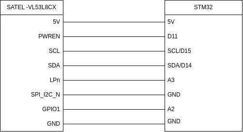
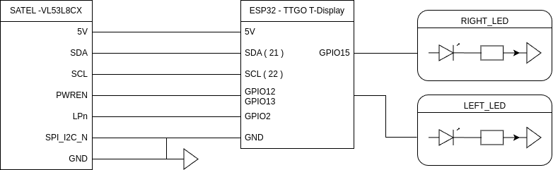
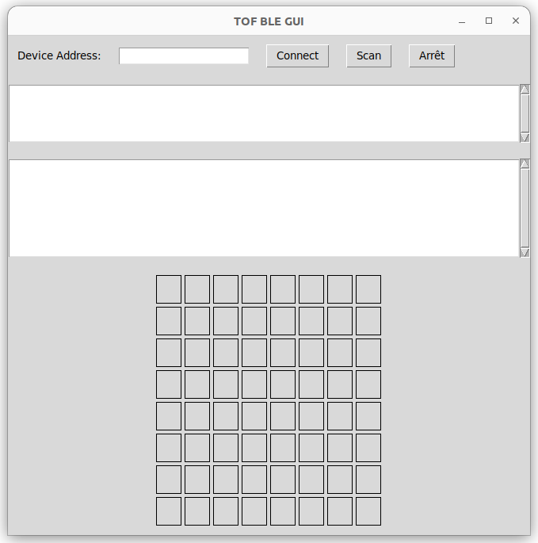

# ToF Solution  

authors : Tinaël Delzenne Zamparutti  --  Alix Deleule

## System Description  
The ToF approach uses the `SATEL-VL53L8CX` multi-zone distance sensor to detect hand and arm gestures. This solution provides gesture mapping through an 8x8 zone grid.  

## Features and Progress  
- **Visualization and Data Archiving**  
  - Connects via BLE and serial interfaces to archive gesture data in JSON or CSV formats.  
- **Neural Network Integration**  
  - Train a neural network to classify gestures (e.g., Left, Right, None).  


# VL53L8CX Connection

## Connection with Nucleo F401RE and Serial PC Communication

This part demonstrates how to interface the VL53L8CX ToF sensor with an Nucleo F401RE microcontroller board and enable serial communication with a PC application for real-time data visualization.

### Overview

The VL53L8CX sensor is connected to the Nucleo F401RE, which runs the `VL53L8CX_SimpleRanging` firmware to gather ranging data. The firmware processes sensor data and sends it to the PC via UART, where [TOF_serial_GUI](Data_processing/TOF_serial_GUI.py) displays the data in real time and logs it for further analysis.



You could find the VL53L8CX_SimpleRanging inside the [X-CUBE-TOF1](https://www.st.com/en/ecosystems/x-cube-tof1.html) packages.

X-CUBE-TOF1/Projects/NUCLEO-F401RE/EXAMPLES/CUSTOM/VL53L8CX_SimpleRanging/

### TOF_serial_GUI

To visualize the data sent by the STM32 we create a GUI based on three functionality :

#### Serial communication
First the serial communication, you can choose the appropriate serial port and Baudrate to receive real-time sensor data. The program also automatically handle connection and disconnection scenarios.

```python
def connect_serial():
    global ser
    try:
        port = port_combobox.get()
        baudrate = int(baudrate_combobox.get())
        ser = serial.Serial(port, baudrate, timeout=1)
        start_reading()
        connect_button.config(state=tk.DISABLED)
        disconnect_button.config(state=tk.NORMAL)
    except serial.SerialException as e:
        text_area.insert(tk.END, f"Error: {e}\n")
        text_area.see(tk.END)
        
def start_reading():
    global read_thread
    read_thread = threading.Thread(target=read_data, daemon=True)
    read_thread.start()
```
#### Archive

We then read the data and archive it in two different formats Json for human analysis and csv for computer analysis we also add timestamps for traceability.

```python
def archive_data(data):
    """
    Archive les données reçues dans un fichier JSON et un fichier CSV avec un horodatage.
    :param data: Les données reçues sous forme de chaîne.
    """
    timestamp = datetime.now().isoformat()  # Format de l'horodatage
    archive_entry = {"timestamp": timestamp, "data": data}  # Structure des données

    # Sauvegarde JSON
    try:
        with open(archive_filename_json, "r") as file:
            archive = json.load(file)  # Charger les données existantes
    except (FileNotFoundError, json.JSONDecodeError):
        archive = []  # Initialiser une nouvelle liste pour cette exécution

    # Ajouter la nouvelle entrée
    archive.append(archive_entry)

    # Écrire les données mises à jour dans le fichier JSON
    with open(archive_filename_json, "w") as file:
        json.dump(archive, file, indent=4)  # Sauvegarde avec indentation pour lisibilité

    # Sauvegarde CSV
    file_exists = os.path.isfile(archive_filename_csv)  # Vérifie si le fichier CSV existe déjà
    with open(archive_filename_csv, "a", newline="") as csvfile:
        csv_writer = csv.writer(csvfile)
        if not file_exists:
            csv_writer.writerow(["Timestamp", "Data"])  # Écrire l'en-tête uniquement si le fichier est nouveau
        csv_writer.writerow([timestamp]+ data.split(','))  # Ajouter une ligne de données
```

#### Visualisation

We created a graphical User Interface in tkinter so we can easily select the serial port and baud rate and display the incoming data string and map values to an 8x8 grid. we also update cell colors dynamically to represent distances using a gradient from red (close) to green (far).

```python
def update_grid(data):
    """
    Met à jour la grille 8x8 avec les valeurs extraites des données, en commençant
    par le coin inférieur gauche, de gauche à droite, puis de bas en haut.
    :param data: Chaîne de caractères sous forme "-2:4,1:4,..."
    """
    try:
        # Transformer les données en une liste d'entiers
        values = [item.split(':')[0] for item in data.split(',') if ':' in item]

        # Parcourir les cases en partant du bas
        index = 0
        for row in range(7, -1, -1):  # Parcourt les lignes de bas en haut
            for col in range(8):  # Parcourt les colonnes de gauche à droite
                if index < len(values):
                    value = values[index]
                    label = grid_labels[row][col]
                    label.config(text=value)  # Mettre à jour le texte
                    # Couleur basée sur la valeur
                    if value == 'X':
                        label.config(bg="grey")
                    else:
                        label.config(bg=get_color(value))
                    index += 1
                else:
                    # Si plus de données, vider la case
                    label = grid_labels[row][col]
                    label.config(text="", bg="white")

def get_color(value):
    """
    Génère une couleur RGB correspondant à un gradient allant de rouge (0) à vert (4000).
    :param value: La valeur entre 0 et 4000.
    :return: Une couleur hexadécimale (#RRGGBB).
    """
    try:
        # Normalisation de la valeur entre 0 et 1
        normalized = max(0, min(int(value) / 4000, 1))
        # Calcul des composantes rouge et verte pour le gradient
        red = int((1 - normalized) * 255)  # Diminue le rouge
        green = int(normalized * 255)  # Augmente le vert
        # Retourne une couleur hexadécimale (#RRGGBB)
        return f"#{red:02x}{green:02x}00"
    except Exception as e:
        print(f"Erreur dans get_color: {e}")
        return "#ffffff"  # Retourne blanc en cas d'erreur

```

For the STM32 Serial connection you want to uses these parameters : 

Port : /dev/ttyACM0

Baudrate : 460800

[Here's the Result](vid/capteur_tof.mp4)

## Connection with ESP32 TTGO-Tdisplay and Serial PC Communication

This part demonstrates how to interface the VL53L8CX ToF sensor with an ESP32 microcontroller board and enable serial communication with a PC application for real-time data visualization.


The Time of Flight sensor is connectef to the ESP32 TTGO T-Display which runs [ESP32_serial](Firmware/ESP32/ESP32_serial.ino), ([Source](https://github.com/stm32duino/VL53L8CX/blob/main/examples/VL53L8CX_HelloWorld_I2C/VL53L8CX_HelloWorld_I2C.ino
)) firmware to gather and send Tof's data. We will then uses [TOF_Serial_Gui](Data_processing/TOF_serial_GUI.py) with these parameters to receive the data : 

Port : /dev/ttyUSB0

Baudrate : 115200



## Connection with ESP32 TTGO-Tdisplay and BLE PC Communication

To connect to the PC via BLE, the sensor is wired in the same way as for the serial connection, but we will modify the ESP32 code ([New version here](Firmware/ESP32/ESP32_serial.ino)).

We add the BLE initialization : 
```cpp
// Initialisation BLE
  BLEDevice::init("ESP32_EUC_VL53L8CX_Sensor");  // Nom de l'appareil BLE
  BLEServer *pServer = BLEDevice::createServer();
  BLEService *pService = pServer->createService(SERVICE_UUID);

  pCharacteristic = pService->createCharacteristic(
    CHARACTERISTIC_UUID,
    BLECharacteristic::PROPERTY_READ |
    BLECharacteristic::PROPERTY_NOTIFY
  );
  pCharacteristic->addDescriptor(new BLE2902());

  pService->start();
  BLEAdvertising *pAdvertising = BLEDevice::getAdvertising();
  pAdvertising->start();
  SerialPort.println("BLE prêt et en mode publicité !");
```

We also modify the print-result function to send data through BLE connection :

```cpp
  pCharacteristic->setValue(data.c_str());  // Met à jour la valeur de la caractéristique
  pCharacteristic->notify();  // Envoie la notification aux clients connectés
```

### TOF_BLE_GUI // BLE_to_CSV

to visualize these data we will use the same base as TO_serial_GUI, we will only modify the connection part so now we are able do scan BLE devices nearby and connect to them thanks to their MAC adress, this program is able to display a grid and archive data just like the first one.

```python
SERVICE_UUID = "4fafc201-1fb5-459e-8fcc-c5c9c331914b"  # Remplacez si nécessaire
CHARACTERISTIC_UUID = "beb5483e-36e1-4688-b7f5-ea07361b26a8"  # Remplacez si nécessaire

async def log_ble_data():
    DEVICE_ADDRESS = device_address_entry.get()  # Récupérer l'adresse du périphérique saisie
    async with BleakClient(DEVICE_ADDRESS) as client:
        print(f"Connexion au périphérique {DEVICE_ADDRESS}")

        # Vérifiez les services et caractéristiques du périphérique
        services = await client.get_services()
        print("Services et caractéristiques :")
        for service in services:
            print(f"Service UUID: {service.uuid}")
            for char in service.characteristics:
                print(f"\tCaractéristique UUID: {char.uuid}")
        
        # Vérifiez si la caractéristique souhaitée existe
        characteristic_found = False
        for service in services:
            for char in service.characteristics:
                if char.uuid == CHARACTERISTIC_UUID:
                    characteristic_found = True
                    break
        
        if not characteristic_found:
            print("Caractéristique non trouvée.")
            return

        # Fonction pour traiter les notifications BLE
        def handle_notification(sender, data):
            line = data.decode("utf-8").strip()
            print(f"Données reçues : {line}")
            text_area.delete(1.0, tk.END)
            text_area.insert(tk.END, f"{line}\n")
            text_area.see(tk.END)  # Auto-scroll to the bottom
            try:
                archive_data(line)
                update_grid(line)
            except (IndexError, ValueError):
                print("Erreur de parsing :", line)

        # Ouvrir les notifications
        await client.start_notify(CHARACTERISTIC_UUID, handle_notification)
        print("Notifications activées. Appuyez sur Ctrl+C pour arrêter.")
        
        # Attente pour recevoir les notifications
        while True:
            await asyncio.sleep(1)

async def scan_ble_devices():
    scan_text_area.delete(1.0, tk.END)  # Effacer le contenu précédent de la text_area du scan
    scan_text_area.insert(tk.END, "Scan des périphériques BLE en cours...\n")  # Ajouter un message initial
    devices = await BleakScanner.discover()
    if not devices:
        scan_text_area.insert(tk.END, "Aucun périphérique détecté.\n")
    else:
        scan_text_area.insert(tk.END, f"{len(devices)} périphérique(s) détecté(s) :\n")
        for device in devices:
            name = device.name
            if "ESP32_EUC" in name:  # Vérifie s'il contient "ESP32_EUC"
                scan_text_area.insert(tk.END, f"Nom : {name}, Adresse MAC : {device.address}\n")
```



Sometimes we got issues with asyncio and tkinter running simultaneously even with the use of threading

## DATA

### Timestamp

### mp4_to_frames

### Entrainement

## Version

### V1

### V2


[Here's the Result](vid/capteur_tof.mp4)


```python

```


stty -F /dev/ttyACM0 460800 
cat /dev/ttyACM0

  - Baud Rate: 460800
  - Data Bits: 8
  - Parity: None
  - Stop Bits: 1

Connéxion au TOF visualisation des valeurs.
Valeur capteur TOF : capteur_valor.png

création du tof GUI (Graphique user interface) en connectique serial (vidéo capteur_tof)

debut du portage en connectique BLE

08/01

Essais connectique uart entre stm32 et ESP32 marche pas 
début du portage VL53L5CX avec ESP32
Utilisation d'un boust pour passer du 3.3V de la ESP32 au 5V du TOF
Essai avec la stm32 le tof ne fonctionne pas en 3,3V
Branchement et code : https://github.com/stm32duino/VL53L8CX/blob/main/examples/VL53L8CX_HelloWorld_I2C/VL53L8CX_HelloWorld_I2C.ino

09/01

TOF fonctionel avec la TTGO T dispay

10/01 
connection TOF BLE fonctionel 
GUI fonctionnel fichuier csv fonctionel

13/01

GUI Couple
attention ajout d'un time delta (d'une heure dans get_video-timestamp) car probleme d'enregistrement et décalage d'un heure

14/01
Modification de GUI couple pour pouvoir labélisé les données et créer un nouveau fichier csv

16/01
BLE_CSV car TOF BLE probléme non résolvable.

17/01 
création du support pour les cartest de test
acquisition de données

18/01 
Modification de GUI COuple pour support windows et labellisation des données

TODO : 

 - Canva
 - ReadMe :

 TO DO
 V3 avec les range en fonction de la hauteur
 Implementation

 Listes des fonctionnalités :

 readme principal : 

 Vidéos de présentation
Lien vers la vidéo pitch youtube
Lien vers la vidéo tutoriel youtube

Liste des dépendances et pré-requis

a
b


Procédure de mise en route

a
b
n

 - Code propre
 - Vidéo présentation
 - Vidéo mise en place Montage et voice over
 comment flash esp32 à faire
 comment flash stm32 (alix)
 Mise en place physique

 - modélisation 3D pour le support


Source : https://github.com/nkolban/ESP32_BLE_Arduino


