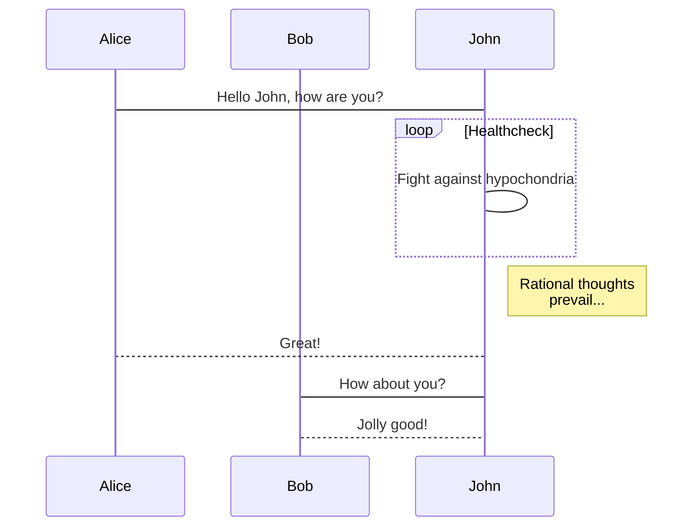

# ToF Solution  

## System Description  
The ToF approach uses the `SATEL-VL53L8CX` multi-zone distance sensor to detect hand and arm gestures. This solution provides gesture mapping through an 8x8 zone grid.  

## Features and Progress  
- **Visualization and Data Archiving**  
  - Connects via BLE and serial interfaces to archive gesture data in JSON or CSV formats.  
- **Neural Network Integration**  
  - Train a neural network to classify gestures (e.g., Left, Right, None).  

authors : Tinaël Delzenne Zamparutti  --  Alix Deleule

# Listes des fonctionnalités :

1. [x] RO
2. [ ] Incomplete features
    1. [ ] Sub-task 1
    2. [x] Sub-task 2
3. [x] ROS Navigation Stack
    1. [x] Sub-task 1
    2. [x] Sub-task 2

# Description de l'algo

# Vidéos de présentation

[Lien vers la vidéo pitch youtube](url)

[Lien vers la vidéo tutoriel youtube](url)

# Liste des dépendances et pré-requis

- a
- b

# Procédure de mise en route

- a
- b

# VL53L8CX Connection

## Connection with Nucleo F401RE and Serial PC Communication

This part demonstrates how to interface the VL53L8CX ToF sensor with an Nucleo F401RE microcontroller board and enable serial communication with a PC application for real-time data visualization.

### Overview

The VL53L8CX sensor is connected to the Nucleo F401RE, which runs the `VL53L8CX_SimpleRanging` firmware to gather ranging data. The firmware processes sensor data and sends it to the PC via UART, where a Python application displays the data in real time and logs it for further analysis.

You could find the VL53L8CX_SimpleRanging inside the [X-CUBE-TOF1](https://www.st.com/en/ecosystems/x-cube-tof1.html) packages.

X-CUBE-TOF1/Projects/NUCLEO-F401RE/EXAMPLES/CUSTOM/VL53L8CX_SimpleRanging/

### TOF_serial_GUI

- **Serial Communication**:
  - Connect to the appropriate serial port to receive real-time sensor data.
  - Automatically handle connection and disconnection scenarios.
  - Archive data in JSON and CSV formats with timestamps for traceability.

- **Dynamic Grid Update**:
  - Parse the incoming data string and map values to an 8x8 grid.
  - Update cell colors dynamically to represent distances using a gradient from red (close) to green (far).

- **Graphical User Interface**:
  - Easy-to-use controls for selecting the serial port and baud rate.
  - Live data display in both textual and graphical formats.
  - Scrolled text area for debugging or detailed data logs.

[Here's the Result](vid/capteur_tof.mp4)

## Connection with ESP32 TTGO-Tdisplay and Serial PC Communication

This part demonstrates how to interface the VL53L8CX ToF sensor with an ESP32 microcontroller board and enable serial communication with a PC application for real-time data visualization.

### Overview

### TOF_serial_GUI

- **Serial Communication**:
  - Connect to the appropriate serial port to receive real-time sensor data.
  - Automatically handle connection and disconnection scenarios.
  - Archive data in JSON and CSV formats with timestamps for traceability.

- **Dynamic Grid Update**:
  - Parse the incoming data string and map values to an 8x8 grid.
  - Update cell colors dynamically to represent distances using a gradient from red (close) to green (far).

- **Graphical User Interface**:
  - Easy-to-use controls for selecting the serial port and baud rate.
  - Live data display in both textual and graphical formats.
  - Scrolled text area for debugging or detailed data logs.

[Here's the Result](vid/capteur_tof.mp4)

## Connection with ESP32 TTGO-Tdisplay and BLE PC Communication

stty -F /dev/ttyACM0 460800 
cat /dev/ttyACM0

  - Baud Rate: 460800
  - Data Bits: 8
  - Parity: None
  - Stop Bits: 1

Connéxion au TOF visualisation des valeurs.
Valeur capteur TOF : capteur_valor.png

création du tof GUI (Graphique user interface) en connectique serial (vidéo capteur_tof)

debut du portage en connectique BLE

08/01

Essais connectique uart entre stm32 et ESP32 marche pas 
début du portage VL53L5CX avec ESP32
Utilisation d'un boust pour passer du 3.3V de la ESP32 au 5V du TOF
Essai avec la stm32 le tof ne fonctionne pas en 3,3V
Branchement et code : https://github.com/stm32duino/VL53L8CX/blob/main/examples/VL53L8CX_HelloWorld_I2C/VL53L8CX_HelloWorld_I2C.ino

09/01

TOF fonctionel avec la TTGO T dispay

10/01 
connection TOF BLE fonctionel 
GUI fonctionnel fichuier csv fonctionel

13/01

GUI Couple
attention ajout d'un time delta (d'une heure dans get_video-timestamp) car probleme d'enregistrement et décalage d'un heure

14/01
Modification de GUI couple pour pouvoir labélisé les données et créer un nouveau fichier csv

16/01
BLE_CSV car TOF BLE probléme non résolvable.

17/01 
création du support pour les cartest de test
acquisition de données

18/01 
Modification de GUI COuple pour support windows et labellisation des données

TODO : 

 - Canva
 - ReadMe : 
// ESP 32 VL53L8CX // TOP BLE GUI // BLE to csv // Partie DATA : 
 timestamp // mp4 to frames GUI couple // entrainement
 V1
 V2
 V3 avec les range en fonction de la hauteur
 - Code propre
 - Vidéo présentation
 - Vidéo mise en place 
 comment flash esp32 à faire
 comment flash stm32 (alix)
 Mise en place physique

 - modélisation 3D pour le support

Source : https://github.com/nkolban/ESP32_BLE_Arduino

